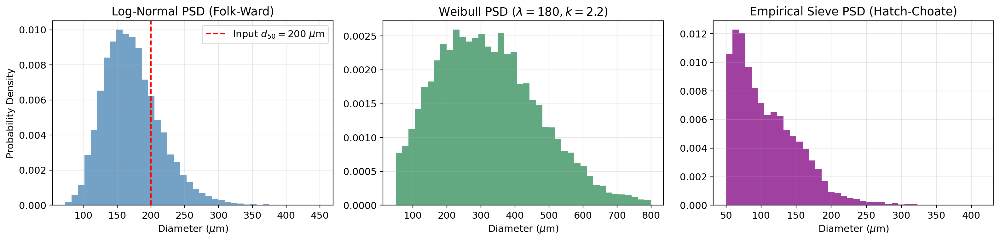
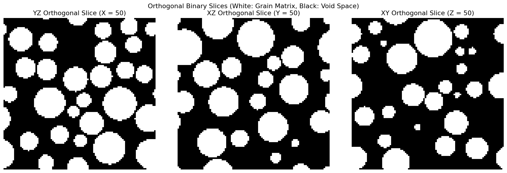
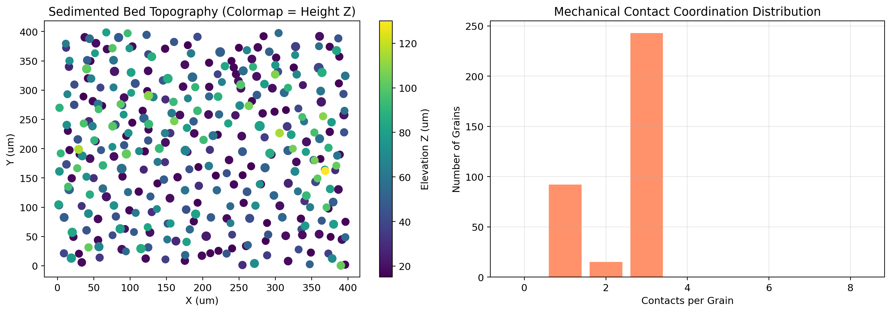
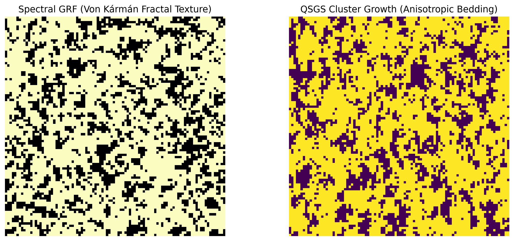
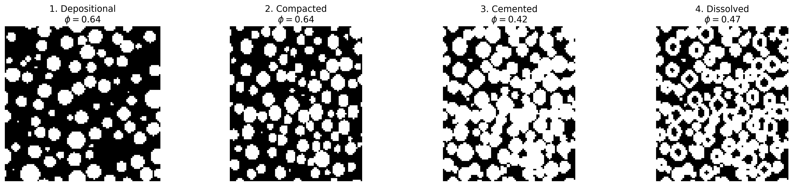
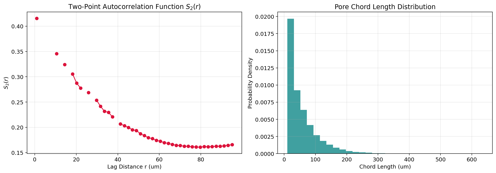

# poropack: 3D Porous Media & Digital Rock Physics Generator

[](https://www.python.org/downloads/)
[](https://opensource.org/licenses/MIT)
[]()

`poropack` is a high-performance Python library for generating, diagenetically transforming, and petrophysically characterizing 3D multi-purpose porous media (granular assemblies, continuum random fields, and synthetic digital rocks) for Digital Rock Physics (DRP) and reservoir simulation.

Originally developed as a simple random sphere pack generator, the repository has been completely modernized into an extensible, scientifically grounded framework.


---

## Visual Gallery & Showcase

<table>
  <tr>
    <td width="50%">
      <h4 align="center">Geological Particle Size Distributions (PSD)</h4>
      
      <p align="center"><em>Continuous Log-Normal, Weibull, and Empirical Sieve PSDs with Hatch-Choate analytical volume-to-number transformation.</em></p>
    </td>
    <td width="50%">
      <h4 align="center">3D Orthogonal Binary Slices (Lagrangian &rarr; Eulerian)</h4>
      
      <p align="center"><em>Sub-volume voxel rasterization (YZ, XZ, XY slices) preserving hard-sphere boundaries and periodic wrap-around.</em></p>
    </td>
  </tr>
  <tr>
    <td width="50%">
      <h4 align="center">3D Ballistic Sedimentation ("Drop-and-Roll")</h4>
      
      <p align="center"><em>Realistic gravitational settling under gravity: topographic bed height map and stable coordination numbers (Z = 3 to 8).</em></p>
    </td>
    <td width="50%">
      <h4 align="center">Continuum Bicontinuous Digital Rocks</h4>
      
      <p align="center"><em>Level-cut Spectral 3D Gaussian Random Fields (Von K&aacute;rm&aacute;n kernel) and Quartet Structure Generation Set (QSGS).</em></p>
    </td>
  </tr>
  <tr>
    <td width="50%">
      <h4 align="center">4-Stage Diagenetic History Modeling</h4>
      
      <p align="center"><em>Depositional grain assembly &rarr; Uniaxial vertical compaction &rarr; EDT syntaxial cementation &rarr; Core dissolution.</em></p>
    </td>
    <td width="50%">
      <h4 align="center">Digital Rock Petrophysics Characterization</h4>
      
      <p align="center"><em>Pore-scale Two-Point Correlation Function S<sub>2</sub>(r) and chord length probability density distributions.</em></p>
    </td>
  </tr>
</table>

---

## Key Features

### 1. Decoupled Dual Representations
- **Lagrangian Particle Domain (`GrainPack`)**: Exact continuous coordinates $(x,y,z)$, radii $r$, bounding dimensions, periodic boundary conditions, and grain metadata.
- **Eulerian Discrete Domain (`VoxelGrid`)**: 3D binary voxel array (phase 0 = pore space, 1 = solid grain/cement) with isotropic voxel resolution $h$.
- **Native Periodic Rasterizer**: Fast sub-volume bounding box rasterizer supporting seamless toroidal wrap-around across $x, y, z$ boundaries without ghost particles or boundary artifacts.

### 2. $O(1)$ Accelerated Spatial Indexing
- Built-in `PeriodicSpatialGrid` implementing dynamic uniform cell-linked lists ($d_{\text{cell}} \ge 2 r_{\max}$).
- $O(1)$ dynamic insertion and local 27-cell collision queries with minimum-image periodic distance calculations.
- Replaces legacy $O(N^2)$ brute-force pairwise checks, generating $10^5$ spheres in seconds.

### 3. Continuous Geological Particle Size Distributions (PSD)
- **Sedimentological Distributions**: `LogNormalPSD`, `WeibullPSD`, `TruncatedGaussianPSD`, `DiscretePSD`, and `EmpiricalSievePSD`.
- **Hatch-Choate Analytical Conversion**: Automatic conversion between volume/mass-weighted sieve percentages and number-weighted sampling densities:
  $$\ln(d_{50,N}) = \ln(d_{50,V}) - 3 (\ln \sigma_g)^2$$
- Folk-Ward sorting coefficient ($\sigma_\phi$) parameterization.

### 4. Four Physics-Grounded Generation Paradigms
1. **Accelerated RSA (`RSAGenerator`)**: Stochastic hard-sphere insertion with minimum throat clearance and full periodic boundary conditions.
2. **Ballistic Sedimentation (`SedimentationGenerator`)**: 3D "Drop-and-Roll" under gravity with 4-stage analytical kinematics:
   - Stage 1: Vertical free-fall under gravity until 1-point contact.
   - Stage 2: Single-sphere rolling along steepest downward gradient until 2-point contact.
   - Stage 3: Double-sphere valley rolling until 3-point stable mechanical equilibrium.
   - Stage 4: Substrate floor contact at $z=0$ with periodic $(x,y)$ boundaries.
3. **Dense Random Packing (`DensePackingGenerator`)**:
   - Force-Biased Algorithm (FBA) with soft Hookean repulsive contact potential.
   - Fast Inertial Relaxation Engine (FIRE) energy minimization.
   - Staged radius inflation breaking the RSA jamming limit ($\phi \ge 0.60$, porosity $\le 0.40$).
   - Strict hard-sphere zero-overlap enforcement via final deflation.
4. **Continuum Bicontinuous Media (`GaussianRandomField` & `QSGSGenerator`)**:
   - Spectral 3D Gaussian Random Fields filtered in Fourier space with Gaussian, Exponential, or Von Kármán covariance kernels.
   - Exact inverse-CDF analytical thresholding for precision target porosity matching.
   - Quartet Structure Generation Set (QSGS) for anisotropic cluster nucleation and growth.

### 5. Post-Depositional Diagenetic Modeling
- **Mechanical Compaction (`apply_compaction`)**: Uniaxial or semi-confined vertical strain tensor deformation inducing grain interpenetration and pore throat constriction. Supports both `GrainPack` and `VoxelGrid`.
- **Syntaxial Cementation (`apply_cementation`)**: Euclidean Distance Transform (EDT) dilation depositing secondary minerals (quartz overgrowths, pore-filling calcite) preferentially in narrow pore throats.
- **Secondary Dissolution (`apply_dissolution`)**: Surface erosion and stochastic vug creation modeling acid leaching and secondary porosity generation.

### 6. Comprehensive Digital Rock Petrophysics
- **Porosity Partitioning (`analyze_porosity`)**: Distinguishing connected/percolating (effective) porosity from isolated dead-end voids with 3D flood-fill clustering and directional percolation checks.
- **Specific Surface Area (`specific_surface_area`)**: Matrix surface area per unit volume ($S_v$) via Crofton integral.
- **Two-Point Correlation Function (`two_point_correlation`)**: Spatial autocorrelation $S_2(r)$ characterizing pore-scale correlation lengths.
- **Chord Length Distribution (`chord_length_distribution`)**: Probability density of chord lengths in pore or solid phase.
- **Kozeny-Carman Permeability (`kozeny_carman`)**: Analytical hydraulic permeability estimation.
- **Pore Network Extraction (`extract_pore_network`)**: Seamless bridge to PoreSpy's SNOW2 algorithm extracting pore bodies, throats, and coordination numbers for OpenPNM simulations.

### 7. Simulation & Visualization Exporters
- **3D TIFF Stacks**: Export to ImageJ, Fiji, Avizo, and Dragonfly.
- **VTK Formats**: XML ImageData (`.vti`) for volumetric rendering and XML PolyData (`.vtp`) for particle glyphs in ParaView.
- **MATLAB / MRST Structs (`.mat`)**: Directly formatted Cartesian grid (`G`) and rock property (`rock.poro`, `rock.perm`) structs for the MATLAB Reservoir Simulation Toolbox (MRST).
- **Tabular CSV & Raw Binary**: High-speed coordinate tables and raw voxel grids.

### 8. Full Backward Compatibility
- Existing workflows using `from genrandsp import generate_spherepack` work out of the box with zero code changes, now executing hundreds of times faster under the hood.

---

## Installation

Clone the repository and install the dependencies:

```bash
git clone https://github.com/saeedtelvari/generate_sphere_pack.git
cd generate_sphere_pack
pip install -r requirements.txt
```

To install `poropack` in editable development mode:

```bash
pip install -e .
```

---

## Quickstart

### 1. Generating a Granular Assembly (RSA)
```python
import poropack as pp

# Define a sedimentological log-normal grain size distribution
psd = pp.LogNormalPSD(d50=150.0, sigma_phi=0.35, bounds=(30.0, 300.0))

# Generate non-overlapping spheres in a 500x500x500 um periodic box
rsa = pp.RSAGenerator(
    box_size=(500.0, 500.0, 500.0),
    psd=psd,
    min_throat=2.0,
    periodic=(True, True, True),
    random_state=42,
)
pack = rsa.generate(target_porosity=0.60)
print(f"Placed {len(pack)} grains with analytical porosity {pack.analytical_porosity():.3f}")

# Rasterize to binary voxel grid at 5 um resolution
voxel_grid = pack.rasterize(voxel_size=5.0)
print(f"Voxel grid dimensions: {voxel_grid.shape}, porosity: {voxel_grid.porosity():.3f}")
```

### 2. Simulating Diagenesis (Compaction + Cementation)
```python
# Apply 15% vertical mechanical compaction
compacted = pp.apply_compaction(voxel_grid, vertical_strain=0.15)

# Precipitate 8% quartz cement into pore throats via EDT dilation
cemented = pp.apply_cementation(compacted, cement_fraction=0.08)

print(f"Original phi: {voxel_grid.porosity():.3f} -> Compacted: {compacted.porosity():.3f} -> Cemented: {cemented.porosity():.3f}")
```

### 3. Petrophysical Characterization
```python
# Partition into effective and isolated porosity
poro_res = pp.analyze_porosity(cemented)
print(poro_res.summary())

# Compute specific surface area and permeability
sv = pp.specific_surface_area(cemented)
k_m2 = pp.kozeny_carman(cemented)
k_mD = k_m2 / 9.869233e-16
print(f"Sv: {sv:.4f} um^-1 | Permeability: {k_mD:.2f} mD")
```

### 4. Exporting to MATLAB / MRST
```python
# Export directly to MRST .mat format
pp.export_mrst_mat(cemented, "digital_rock.mat", permeability_mD=k_mD)
```

In MATLAB with MRST:
```matlab
% In MATLAB terminal:
startup
mrstModule add incomp

% Load exported porous medium
data = load('digital_rock.mat');
G = cartGrid(data.G.cartDims, data.G.dimensions);
G = computeGeometry(G);
rock = data.rock;

% Setup and run standard single-phase flow
state = initResSol(G, 100*barsa, 0.0);
% Proceed with MRST simulation pipeline...
```

---

## Interactive Tutorial Notebooks

A modular suite of step-by-step Jupyter notebooks is available in the [`notebooks/`](notebooks/) directory:

1. [**`01_quickstart_and_psd.ipynb`**](notebooks/01_quickstart_and_psd.ipynb): Quickstart, geological PSDs (LogNormal, Weibull, Sieve curves with analytical Hatch-Choate volume-to-number conversion), accelerated RSA generation, and `VoxelGrid` rasterization.
2. [**`02_physical_generators.ipynb`**](notebooks/02_physical_generators.ipynb): 3D Ballistic Sedimentation ("Drop-and-Roll" under gravity), Dense Random Packing (FBA + FIRE breaking the RSA jamming limit), and Continuum Spectral GRF / QSGS cluster growth.
3. [**`03_diagenesis_and_petrophysics.ipynb`**](notebooks/03_diagenesis_and_petrophysics.ipynb): Geological diagenetic sequence (compaction $\to$ cementation $\to$ dissolution) and petrophysics (effective porosity, $S_v$, $S_2(r)$, chords, Kozeny-Carman, SNOW2 PNM).
4. [**`04_reservoir_simulation_and_exports.ipynb`**](notebooks/04_reservoir_simulation_and_exports.ipynb): Multiformat exporters (3D TIFF, ParaView VTK, Parquet, CSV) and complete MATLAB MRST single-phase flow simulation workflow.

Alternatively, a comprehensive all-in-one demonstration is available in [`examples_v2.ipynb`](examples_v2.ipynb).

---

## Developer & Agent Guide

For AI coding agents and developers working on or extending the codebase, consult [**`AGENTS.md`**](AGENTS.md) for architectural guidelines, domain terminology rules ([`CONTEXT.md`](CONTEXT.md)), standard recipes, and quality gates.

---

## Running Tests

Run the full automated test suite with `pytest`:

```bash
pytest tests/ -v
```

All 21 test suites cover representations, spatial hashing, PSDs, generators, diagenesis, petrophysics, exporters, and backward compatibility.

---

## License

MIT License. See [LICENSE](LICENSE) for details.
